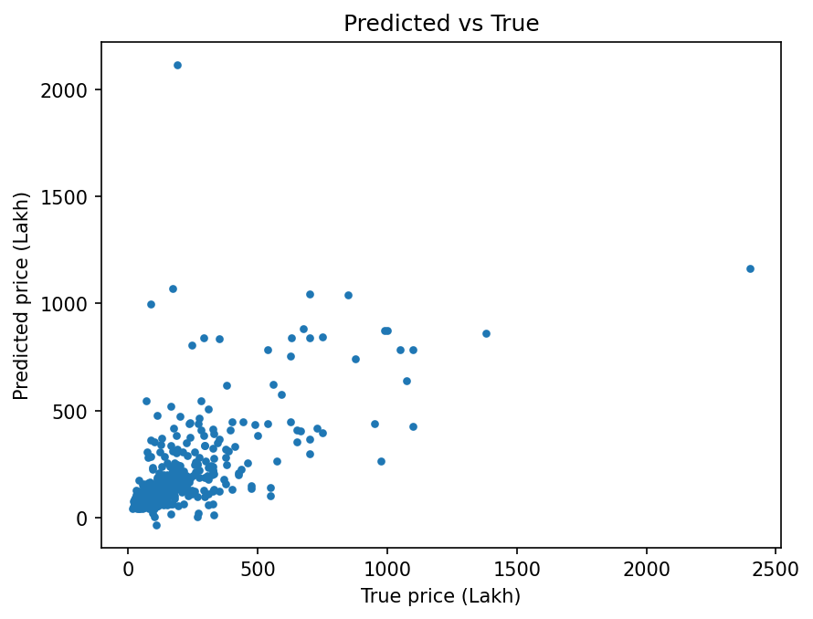
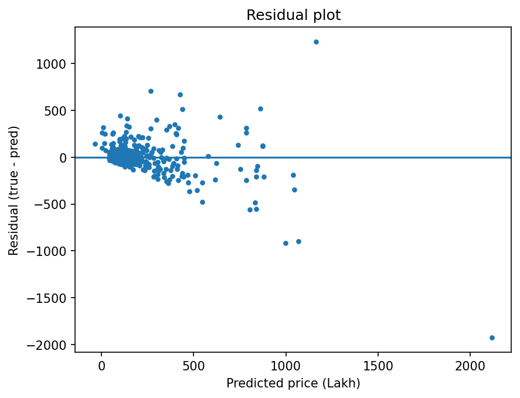

# 🏙️ Mumbai House Price Prediction 🏠💸

Predict **Mumbai residential property prices** using machine learning, based on structured listing features such as **area (sq ft)**, **BHK**, **property type**, **region/locality**, **availability**, and **property age**.

✅ Reproducible pipeline (build dataset → train → evaluate)  
📦 Saved model artifact (`models/model.joblib`)  
📊 Auto-generated metrics + plots (`reports/metrics.json`, `reports/figures/`)

---

## ✨ Badges (Stickers)


---

## 📌 Problem
Given a set of property listing attributes, predict the **sale price** of residential properties in Mumbai.

This is a **regression** task (not classification), so evaluation uses:
- **MAE**
- **RMSE**
- **R²**

---

## 🧾 Dataset (Columns)
The dataset includes:

- **bhk**: number of bedrooms/hall/kitchen (BHK)
- **type**: apartment / villa / independent house / studio apartment
- **locality**: locality name
- **area**: property area (sq ft)
- **region**: region of the property
- **status**: Ready to move / Under construction
- **age**: New / Resale / unknown (treated as missing)
- **price** and **price_unit**:
  - `L` = Lakh (1 Lakh = 100,000 INR)
  - `Cr` = Crore (1 Crore = 10,000,000 INR)

🎯 **Target**: price converted into **Lakh** (`price_lakh`) in the processed dataset.

---

## 🗂️ Project Structure

```

.
├── src/
│   ├── make_dataset.py     # build processed dataset
│   ├── train.py            # train and save model
│   ├── evaluate.py         # evaluate, save metrics + plots
│   ├── predict.py          # inference with JSON input (optional)
│   └── utils.py            # helper functions
├── data/
│   ├── raw/                # raw CSV files (input)
│   └── processed/          # processed dataset (output)
├── models/
│   └── model.joblib        # trained pipeline
├── reports/
│   ├── metrics.json        # evaluation metrics
│   └── figures/            # evaluation plots
├── notebooks/              # exploratory notebooks (EDA/cleaning/modeling)
└── requirements.txt

````

---

## ⚙️ Setup

```bash
pip install -r requirements.txt
````

---

## 🚀 How to Run (End-to-End)

### 1️⃣ Build the processed dataset

Creates: `data/processed/final.csv`

```bash
python -m src.make_dataset
```

### 2️⃣ Train the model

Creates: `models/model.joblib`

```bash
python -m src.train
```

### 3️⃣ Evaluate the model

Creates:

* `reports/metrics.json`
* `reports/figures/pred_vs_true.png`
* `reports/figures/residuals.png`

```bash
python -m src.evaluate
```

---

## 📈 Results (Current Run)

Test set size: **n_test = 515**

* ✅ **MAE**: 83.76 (Lakh)
* ✅ **RMSE**: 170.37 (Lakh)
* ✅ **R²**: 0.3544

Saved in: `reports/metrics.json`

---

## 🖼️ Outputs (Plots)

### Predicted vs True



### Residual Plot



> If you don’t see images on GitHub, ensure the PNG files exist and are committed (see the “Do I need images?” section below).

---

## 🧠 Modeling Notes

* Uses a **scikit-learn Pipeline**:

  * 🧹 Missing value handling (imputation)
  * 🏷️ Categorical encoding (One-Hot)
  * 🌲 Tree-based regressor (good baseline for mixed feature types)
* High-cardinality fields (like **locality**) are handled using frequency thresholding (`min_frequency`) to reduce sparsity.

---

## 🔍 Limitations & Next Steps

* 🧩 Add richer features (amenities, exact geo-coordinates, building quality, parking, etc.)
* 🧪 Add **K-Fold Cross Validation** and compare multiple models
* 📉 Try **log-transform** of the target price (handle skew)
* 🏷️ Better categorical handling (Target Encoding with leakage-safe CV)
* 🕵️ Error analysis by region/type/area bins to understand model weaknesses

---

## ♻️ Reproducibility

Run everything with:

```bash
pip install -r requirements.txt
python -m src.make_dataset
python -m src.train
python -m src.evaluate
```

---

## 🧾 License

This project is licensed under the **MIT License** — see the [LICENSE](LICENSE) file for details.

---

## 🤝 Contact

If you have feedback or suggestions, feel free to open an issue or reach out.


